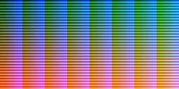
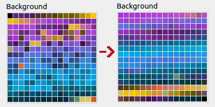

# GBA / NDS / DSi image and video conversion tools

This folder contains some tools to convert / compress images and videos to GBA and NDS formats:  

* [colormap555](colormap555.cpp) - Generate the file [colormap555.png](colormap555.png) that can be used to convert images directly to the GBAs RGB555 color-space with good quality.
* [gimppalette555](gimppalette555.cpp) - Generate the file [GBA.gpl](GBA.gpl) for using / editing / painting with GBA colors in Gimp.
* [hex2gba](hex2gba.cpp) - Convert a RGB888 color to GBA RGB555 / BGR555 high-color format.
* [img2h](img2h.cpp) - Convert / compress a (list of) image(s) that can be read with [ImageMagick](https://imagemagick.org/index.php) to a .h / .c file to compile them into your program. Can convert images to a tile- or sprite-compatible format ("1D mapping" order) and compress them with LZ77. Suitable to compress small image sequences too.

If you find a bug or make an improvement your pull requests are appreciated.

## License

All of this is under the [MIT License](LICENSE). Uses the wonderful [cxxopts](https://github.com/jarro2783/cxxopts) for command line argument parsing.

## Prequisites

* You **must** have ImageMagick / [Magick++](https://imagemagick.org/script/magick++.php) installed for compiling. Install it with:

  ```apt install libmagick++-dev```

* You must have [ImageMagick](https://imagemagick.org/index.php) installed for using the "convert" tool. Install it with:

  ```apt install imagemagick```

* For compressing data with LZ77 you need to have [devkitPro / devKitARM](https://devkitpro.org) [installed](https://devkitpro.org/wiki/Getting_Started) and the environment variable ```$DEVKITPRO``` set, or the [gbalzss](https://github.com/devkitPro/gba-tools) tool in your ```$PATH```.

## Building

### From the command line

Navigate to the GBA-image-tools folder, then:

```sh
mkdir build && cd build
cmake ..
make
```

### From Visual Studio Code

* **Must**: Install the "C/C++ extension" by Microsoft.
* **Recommended**: If you want intellisense functionality install the "C++ intellisense" extension by austin.
* **Must**: Install the "CMake Tools" extension by Microsoft.
* You might need to restart / reload Visual Studio Code if you have installed extensions.
* Open the GBA-image-tools folder using "Open folder...".
* Choose a kit of your choice as your active CMake kit if asked.
* You should be able to build now using F7 and build + run using F5.

## Hints for paint programs

* Store images as Truecolor PNGs and [convert / dither them using ImageMagick](#convert-an-image-to-gba-rgb555-format-with-a-restricted-number-of-colors). This usually gives higher quality results.
* In Gimp make sure that when you store your paletted / indexed images to PNG select the "automatic pixel format" option. This will ensure the minimum number of colors will be stored in the palette. Storing as "8bpc GRAY" or "8bpc GRAYA" will store a full 256 color palette.

## Convert an image to GBA RGB555 format with a restricted number of colors

```convert INFILE -colors NROFCOLORS -remap colormap555.png OUTFILE```

If you convert an image for GBA and use regular dithering it will be converted to RGB888 first, dithered and then later converted to RGB555 trying to match colors, which can give bad results. This option will use the GBAs RGB555 color map [colormap555.png](colormap555.png)  
  
to restrict output colors to the GBA color "palette" of possible RGB555 colors while dithering, which gives much better results.  
If you use wildcards for a list of images, you can also a create common palette for all images using "[+remap](https://www.imagemagick.org/script/command-line-options.php?#remap)" instead:

```convert INFILE -colors 255 +remap colormap555.png png8:OUTFILE```

Use a wildcard for INFILE, e.g. "in*.png". This will create a common palette from all images it finds for "in*.png" first and store it. Then the individual conversion to paletted images is done. The "png8:" prefix tells ImageMagick to store indexed 8-bit PNGs.  
To make sure your files are correctly ordered for further processing steps add "%0Xd" (printf-style) to the output to append a custom number to the file name:

```convert INFILE -colors 255 +remap colormap555.png png8:foo_%02d.png```

This will generate the file names "foo_00.png", "foo_01.png" and so on.

If you have images with larger flat areas of color and they come out all garbled due to the dithering, try the "[-posterize](https://www.imagemagick.org/script/command-line-options.php?#posterize)" option instead:

```convert INFILE -posterize 6 -remap colormap555.png OUTFILE```

## img2h general usage

Call img2h like this: ```img2h [CONVERSION] [COMPRESSION] INFILE [INFILEn...] OUTNAME```

* ```CONVERSION``` is optional and means the type of conversion to be done:
  * [```--reordercolors```](#reordering-palette-colors) - Reorder palette colors to minimize preceived color distance.
  * [```--addcolor0=COLOR```](#adding-a-color-to-index--0-in-the-palette) - Add COLOR at palette index #0 and increase all other color indices by 1.
  * [```--movecolor0=COLOR```](#moving-a-color-to-index--0-in-the-palette) - Move COLOR to palette index #0 and move all other colors accordingly.
  * [```--tiles```](#generating-8x8-tiles-for-tilemaps) - Cut data into 8x8 tiles and store data tile-wise.
  * [```-sprites=W,H```](#generating-sprites) - Cut data into sprites of size W x H and store data sprite- and 8x8-tile-wise.
  * [```--interleavedata```](#interleaving-data) - Interleave image data from multiple images into one big array.
* ```COMPRESSION``` is optional and means the type of compression to apply:
  * [```--lz10```](#compressing-data) - Use LZ77 compression ["variant 10"](http://problemkaputt.de/gbatek.htm#biosdecompressionfunctions).
  * [```--lz11```](#compressing-data) - Use LZ77 compression ["variant 11"](http://problemkaputt.de/gbatek.htm#lzdecompressionfunctions).
  * [```--vram```](#compressing-data) - Structure compressed data safe to decompress directly to VRAM.  
  Valid combinations are e.g. ```--lz10 --vram```.
* ```INFILE / INFILEn``` specifies the input image files. **Multiple input files will always be stored in one .h / .c file**. You can use wildcards here (in Linux, not working in Windows).
* ```OUTNAME``` is the (base)name of the output file and also the name of the prefix for #defines and variable names generated. "abc" will generate "abc.h", "abc.c" and #defines / variables names that start with "ABC_".

The order of the operations performed is: Read all input files ➜ reordercolors ➜ addcolor0 ➜ movecolor0 ➜ tiles / sprites ➜ compress ➜ interleavedata ➜ Write output

Some general information:

* Some combinations of options make no sense, but img2h will not check that.
* All data stored to output files will be aligned to 4 bytes and padded to 4 bytes. Zero bytes will be added if necessary.
* When processing **multiple input images** they **will be stored in a single .h / .c file**. Thus they must have the same width, height and bit depth.
* When processing multiple paletted input images, their palettes will be padded with black colors / zero bytes to the size of the biggest palette.
* Data with a palette <= 16 colors will be stored as nibbles, thus an 8x8 tile will use 4 bytes. Data with a palette > 16 colors will be stored as bytes, thus an 8x8 tile will use 8 bytes.
* Truecolor data will be converted to RGB555.

## img2h options

### Reordering palette colors

Use ```--reordercolors``` to move "visually closer" colors next to each other in the palette. This can help if you try to do filtering / interpolation / jittering with paletted colors. Uses a [simple metric](https://www.compuphase.com/cmetric.htm) to compute color distance with highly subjective results. For improvements see this [stackoverflow entry](https://stackoverflow.com/a/40950076).  


### Adding a color to index #0 in the palette

On GBA the color at palette index #0 is always transparent. Some conversions leave you with the correct color palette, but no transparent color at index #0. You can use the option ```--addcolor0``` to add a specific color at index #0 in the palette:

```img2h --addcolor0=COLORVALUE INFILE(s) OUTNAME```

COLORVALUE is a hex color value, e.g. "AA2345" or "123def". This only works if the input palette has less than 256 colors.

### Moving a color to index #0 in the palette

When using ImageMagick for color mapping / conversion the correct color might not end up being the first in the color palette. You can use the option ```--movecolor0``` to move a color to index #0 in the palette:

```img2h --movecolor0=COLORVALUE INFILE(s) OUTNAME```

COLORVALUE is a hex color value, e.g. "AA2345" or "123def".

### Generating 8x8 tiles for tilemaps

To store images as tiles use the option ```--tiles```. This will cut the image into 8x8 tiles going horizontally first. Prequisites:

* Image must be paletted
* Image width and height must be a multiple of 8

The data will be stored so that you can simply memcpy it over to VRAM.

### Generating sprites for sprite OBJs

To store images as sprites use the option ```--sprites=W,H```. This will cut the image into WxH-sized sprites going horizontally first. Those sprites will then be converted to 8x8 tiles. Prequisites:

* Image must be paletted
* Image width must be a multiple of W and of 8 (for tile-conversion)
* Image height must be a multiple of H and of 8 (for tile-conversion)
* It makes sense that W and H are in [8, 16, 32, 64] (allowed GBA sprite sizes), but this isn't enforced

The data will be stored in ["1D mapping"](http://problemkaputt.de/gbatek.htm#gbalcdvideocontroller). You can simply memcpy it over to VRAM, but don't forget to set the "OBJ Character VRAM Mapping" flag.

### Interleaving data

If you have data you always read in combination, e.g. 8-bit colormap pixel and 8-bit heightmap value, use ```--interleavedata``` to interleave data of multiple images into one data "stream". This can help you save wait cycles on the GBA by combining reads:

```img2h --interleavedata INFILE0 INFILE1 OUTNAME```

This will put image data 0 of file 0 and image data 0 of file 1 next to each other: I0D0, I1D0, I0D1, I1D1... Palettes will be stored in regular, uninterleaved order.

### Compressing data

You can compress data using ```--lz10``` (LZ77 ["variant 10"](http://problemkaputt.de/gbatek.htm#biosdecompressionfunctions), GBA / NDS / DSi BIOS compatible) and ```--lz11``` (LZ77 ["variant 11"](http://problemkaputt.de/gbatek.htm#lzdecompressionfunctions)). To be able to safely decompress data to VRAM, add the option ```--vram```. Compression needs the [devKitPro](https://devkitpro.org) tool [gbalzss](https://github.com/devkitPro/gba-tools) which it will try to find through the ```$DEVKITPRO``` environment variable or in ```$PATH```.

## TODO

* Sort colors by hue and lightness before reordering
* Resolve wildcards on Windows
* Compress with LZSS directly