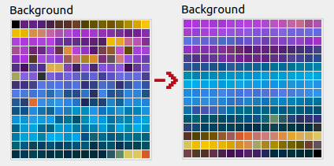
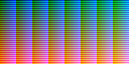

# img2h - convert images to .h / .c files

## General usage

Call img2h like this: ```img2h [CONVERSION] [DATA COMPRESSION] INFILE [INFILEn...] OUTNAME```

* ```CONVERSION``` is optional and means the type of conversion to be done:
  * [```--reordercolors```](#reordering-palette-colors) - Reorder palette colors to minimize preceived color distance.
  * [```--addcolor0=COLOR```](#adding-a-color-to-index--0-in-the-palette) - Add COLOR at palette index #0 and increase all other color indices by 1.
  * [```--movecolor0=COLOR```](#moving-a-color-to-index--0-in-the-palette) - Move COLOR to palette index #0 and move all other colors accordingly.
  * [```--shift=N```](#shifting-index-values) - Increase image index values by N, keeping index #0 at 0.
  * [```--prune=N```](#pruning-index-values) - Reduce depth of image index values to 1,2 or 4 bit, depending on N.
  * [```--sprites=W,H```](#generating-sprites) - Cut data into sprites of size W x H and store spritewise. You might want to add ```--tiles```.
  * [```--tiles```](#generating-8x8-tiles-for-tilemaps) - Cut data into 8x8 tiles and store data tile-wise.
  * [```--interleavepixels```](#interleaving-pixels) - Interleave pixels from multiple images into one big array.
* ```DATA COMPRESSION``` is optional and means the type of compression to apply:
  * [```--delta8```](#compressing-data) - 8-bit delta encoding ["Diff8"](http://problemkaputt.de/gbatek.htm#biosdecompressionfunctions).
  * [```--delta16```](#compressing-data) - 16-bit delta encoding ["Diff16"](http://problemkaputt.de/gbatek.htm#biosdecompressionfunctions).
  * [```--rle```](#compressing-data) - Use RLE compression (http://problemkaputt.de/gbatek.htm#biosdecompressionfunctions).
  * [```--lz10```](#compressing-data) - Use LZ77 compression ["variant 10"](http://problemkaputt.de/gbatek.htm#biosdecompressionfunctions).
  * [```--lz11```](#compressing-data) - Use LZ77 compression ["variant 11"](http://problemkaputt.de/gbatek.htm#biosdecompressionfunctions).
  * [```--vram```](#compressing-data) - Structure LZ-compressed data safe to decompress directly to VRAM.  
  Valid combinations are e.g. ```--diff8 --lz10``` or ```--lz10 --vram```.
* ```INFILE / INFILEn``` specifies the input image files. **Multiple input files will always be stored in one .h / .c file**. You can use wildcards here, e.g. "dir/file\*.png".
* ```OUTNAME``` is the (base)name of the output file and also the name of the prefix for #defines and variable names generated. "abc" will generate "abc.h", "abc.c" and #defines / variables names that start with "ABC_".

The order of the operations performed is: Read all input files ➜ reordercolors ➜ addcolor0 ➜ movecolor0 ➜ shift ➜ prune ➜ sprites ➜ tiles ➜ delta8 / delta16 ➜ rle ➜ lz10 / lz11 ➜ interleavepixels ➜ Write output

Some general information:

* Some combinations of options make no sense, but img2h will not check that.
* All data stored to output files will be aligned to 4 bytes and padded to 4 bytes. Zero bytes will be added if necessary.
* When processing **multiple input images** they **will be stored in a single .h / .c file**. Thus they must have the same width, height and bit depth.
* When processing multiple paletted input images, their palettes will be padded with black colors / zero bytes to the size of the biggest palette.
* Truecolor data will be converted to RGB555.

## Options

### Reordering palette colors

Use ```--reordercolors``` to move "perceptually closer" colors next to each other in the palette. This can help if you try to do filtering / interpolation / jittering or video compression with paletted colors. Sorts colors by hue, saturation and lightness, then uses a [simple metric](https://www.compuphase.com/cmetric.htm) to compute color distance with highly subjective results. For improvements see this [stackoverflow entry](https://stackoverflow.com/a/40950076).  


### Adding a color to index #0 in the palette

On GBA the color at palette index #0 is always transparent. Some conversions leave you with the correct color palette, but no transparent color at index #0. You can use the option ```--addcolor0``` to add a specific color at index #0 in the palette:

```img2h --addcolor0=COLORVALUE INFILE(s) OUTNAME```

COLORVALUE is an RGB hex color value, e.g. "AA2345" or "123def". This only works if the input palette has less than 256 colors.

### Moving a color to index #0 in the palette

When using ImageMagick for color mapping / conversion the correct color might not end up being the first in the color palette. You can use the option ```--movecolor0``` to move a color to index #0 in the palette:

```img2h --movecolor0=COLORVALUE INFILE(s) OUTNAME```

COLORVALUE is an RGB hex color value, e.g. "AA2345" or "123def".

### Pruning index values

There's no way to store regular paletted images with 4-bit indices only, but 4-bit data is needed for 16-color tiles or -sprites. When a 256-color paletted image contains only 16 or less colors you can reduce index data to 4-bit values by passing the option ```--prune=4```. After the conversion an 8x8@4 tile will use 4 bytes, a 8x8@8 tile will use 8 bytes. ```N``` can also be set to 1 or 2 for storing masks or saving ROM space.

### Shifting index values

When multiple images, tiled backgrounds or sprites share a palette (e.g. sprite #1 uses colors 0-63, sprite #2 colors 64-127 etc.) index values need to be adjusted when copying. You can use the option ```--shift``` to shift index values by an amount N in the conversion process so they can be copied straight to memory:

```img2h --shift=N INFILE(s) OUTNAME```

N must be a number in [1, 255]. The resulting index values will be clamped to [0, 255]. Index 0 will not be increased and STAY index #0. The color map will NOT be adjusted either!

### Generating sprites for sprite OBJs

To store images as sprites use the option ```--sprites=W,H```. This will cut the image into WxH-sized sprites going horizontally first. Those sprites will NOT be automatically converted to tiles (hint: use the ```--tiles``` option). Prequisites:

* Image must be paletted
* Image width must be a multiple of W and of 8 (for tile-conversion)
* Image height must be a multiple of H and of 8 (for tile-conversion)
* It makes sense that W and H are in [8, 16, 32, 64] (allowed GBA sprite sizes), but this isn't enforced

The data will be stored in ["1D mapping"](http://problemkaputt.de/gbatek.htm#lcdobjvramcharactertilemapping). You can simply memcpy it over to VRAM, but don't forget to set the "OBJ Character VRAM Mapping" flag.

### Generating 8x8 tiles for tilemaps

To store images as tiles use the option ```--tiles```. This will cut the image into 8x8 tiles going horizontally first. Prequisites:

* Image must be paletted
* Image width and height must be a multiple of 8

The data will be stored so that you can simply memcpy it over to VRAM.

### Interleaving pixels

If you have data you always read in combination, e.g. an 8-bit colormap pixel and 8-bit heightmap pixel, use ```--interleavepixels``` to interleave pixels of multiple images into one data "stream". This can help you save wait cycles on the GBA by combining reads:

```img2h --interleavepixels INFILE0 INFILE1 OUTNAME```

This will put image pixel 0 of file 0 and image pixel 0 of file 1 next to each other: I0P0, I1P0, I0P1, I1P1... This will honor bpp and interleave in 8 or 16 bit intervals. Images need to be the same size. Palettes will be stored in regular, uninterleaved order.

### Compressing data

You can compress data using ```--lz10``` (LZ77 ["variant 10"](http://problemkaputt.de/gbatek.htm#biosdecompressionfunctions), GBA / NDS / DSi BIOS compatible) and ```--lz11``` (LZ77 ["variant 11"](http://problemkaputt.de/gbatek.htm#biosdecompressionfunctions)). To be able to safely decompress LZ-compressed data to VRAM, add the option ```--vram```. LZ-compression needs the [devKitPro](https://devkitpro.org) tool [gbalzss](https://github.com/devkitPro/gba-tools) which it will try to find through the ```$DEVKITPRO``` environment variable or in ```$PATH```.  
To improve compression you can apply run-length-encoding using ```--rle``` (See ["RLUnComp"](http://problemkaputt.de/gbatek.htm#biosdecompressionfunctions)) or apply diff- / delta-encoding using ```--diff8``` or ```--diff16``` which will store the difference of consecutive 8- or 16-bit values instead of the actual data (See ["Diff8bitUnFilter"](http://problemkaputt.de/gbatek.htm#biosdecompressionfunctions)).

## General hints for processing images in paint programs

* Store images as Truecolor PNGs and [convert / dither them using ImageMagick](#convert-an-image-to-gba-rgb555-format-with-a-restricted-number-of-colors). This usually gives higher quality results.
* In Gimp make sure that when you store your paletted / indexed images to PNG select the "automatic pixel format" option. This will ensure the minimum number of colors will be stored in the palette. Storing as "8bpc GRAY" or "8bpc GRAYA" will store a full 256 color palette.

### Convert an image to GBA RGB555 format with a restricted number of colors

```convert INFILE -colors NROFCOLORS -remap colormap555.png OUTFILE```

If you convert an image for GBA and use regular dithering it will be converted to RGB888 first, dithered and then later converted to RGB555 trying to match colors, which can give bad results. This option will use the GBAs RGB555 color map [colormap555.png](colormap555.png)  
  
to restrict output colors to the GBA color "palette" of possible RGB555 colors while dithering, which gives much better results.  
If you use wildcards for a list of images, you can also a create common palette for all images using "[+remap](https://www.imagemagick.org/script/command-line-options.php?#remap)" instead:

```convert INFILE -colors 255 +remap colormap555.png png8:OUTFILE```

Use a wildcard for INFILE, e.g. "in*.png". This will create a common palette from all images it finds for "in*.png" first and store it. Then the individual conversion to paletted images is done. The "png8:" prefix tells ImageMagick to store indexed 8-bit PNGs.  
To make sure your files are correctly ordered for further processing steps add "%0Xd" (printf-style) to the output to append a custom number to the file name:

```convert INFILE -colors 255 +remap colormap555.png png8:foo_%02d.png```

This will generate the file names "foo_00.png", "foo_01.png" and so on.

If you have images with larger flat areas of color or want to reduce images to a low number of colors results might look all garbled. This can be due to dithering. Try the "[-posterize](https://www.imagemagick.org/script/command-line-options.php?#posterize)" option:

```convert INFILE -posterize 6 -remap colormap555.png OUTFILE```

or change / turn off dithering using "[-dither](https://www.imagemagick.org/script/command-line-options.php?#dither)" option instead:

```convert INFILE -dither none -colors 15 -remap colormap555.png OUTFILE```

If this still does not give you the desired output (too many colors, bad quality), try swapping the ```-colors``` option to the back:

```convert INFILE -remap colormap555.png -colors NROFCOLORS OUTFILE```

## TODO

* Do all processing in RGB, store truecolor as BGR in the end
* Add builtin -remap and +remap option from ImageMagick
* Syntax to apply options to single file only?
* Compress with LZSS directly